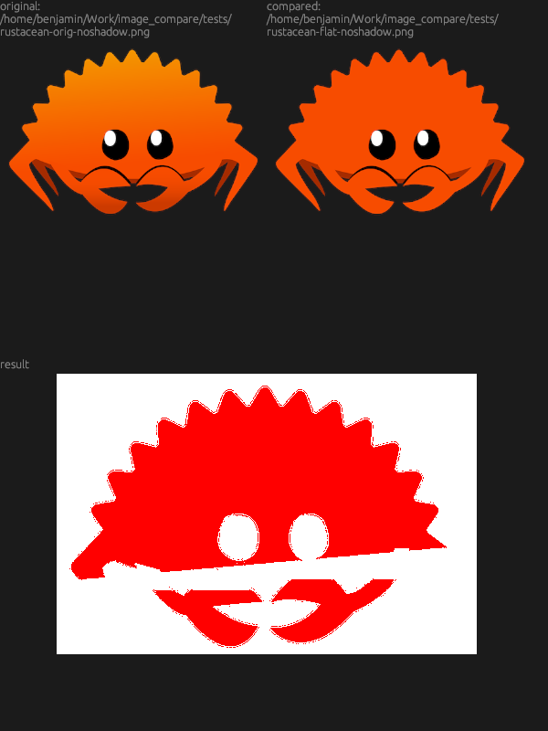

= KS Image Compare

When creating GUI's, sometimes changes to the code will change the
appearance of the GUI in unexpected but often subtle ways. KS Image
Compare shows any GUI changes and visually display their differences. It
can be easily integrated into git (or any other VCS) to alert you about
any changes.

KS Image Compare is also perfect for checking modifications after
editing photos or graphics!

== Description

KS Image Compare takes two images as inputs and shows the discrepancies
between them. Useful for comparing edited versions of pictures or
verifying adjustments made in graphic design projects.

=== Installation

==== From Source code
To get started with KS Image Compare, ensure you have installed
https://www.rust-lang.org/[Rust] and Cargo on your system first. Once
done, simply clone this repository and build the binary using:

[source, sh]
----
git clone https://github.com/kober-systems/image_compare.git
cd image_compare
cargo build --release
----

This will create an executable named `image_compare` within the
target/release directory.

=== Usage Examples

Run the following command, replacing `<IMAGE1>` and `<IMAGE2>` with
paths to your images:

[source, sh]
----
image_compare <IMAGE1> <IMAGE2>
----

The resulting output highlights areas where both images differ.

=== Contributing Guidelines
We welcome bug reports and feature requests through issues. Feel free to
submit PRs for typos, broken links, or improvements.

=== License
KS Image Compare is released under the MIT License - see LICENSE for more
information.

=== Contact Information
For direct integration into your company workflow, please visit
our website at https://kober-systems.com[] or send us an email at
contact@kober-systems.com. Questions, feedback, collaboration
opportunities are also always welcome.

Inspired by https://tortoisesvn.net/TortoiseIDiff.html[TortoiseDiff] and
https://approvaltests.com/[Approval Test].

